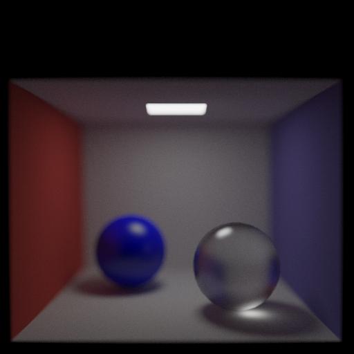
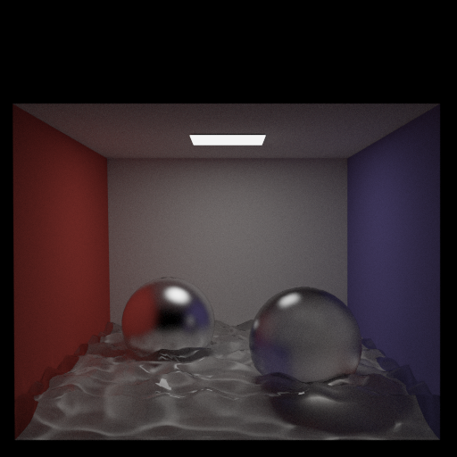

# Features #
- Unbiased Monte Carlo path tracing
- Global illumination: diffuse interreflection (color bleed), soft shadows, caustics, ambient occlusion, indirect lighting, etc.
- Anti-aliased sampling (Gaussian kernel)
- Finite-size lens (depth of field)
- Multiple materials
1. emissive
2. diffuse
3. specular metal
4. specular glass
5. rough metal
6. frosted glass
7. plastic/porcelain (diffuse + specular/glossy reflection)
- (Multiple) importance sampling for each material
1. Power heuristics
- Fresnel for dielectrics
- Russian roulette path selection/termination

